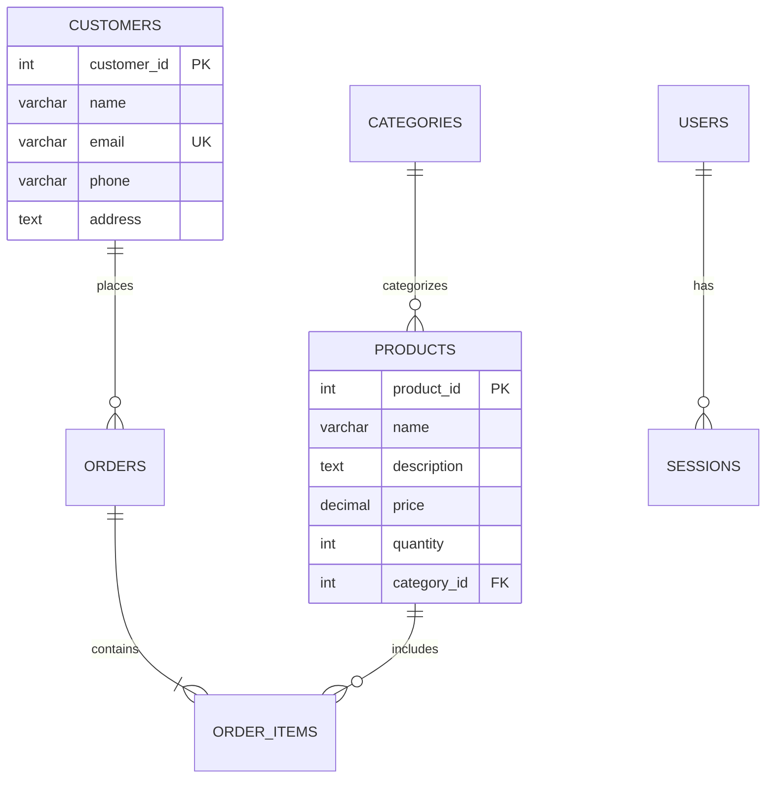

# 🛒 Grocery Store Management System

A complete web-based grocery store management system built with **PHP, MySQL, HTML, CSS, and JavaScript**. Features inventory management, customer tracking, order processing, and sales reporting.


 

## 📋 Table of Contents

- [Features](#-features)
- [Technology Stack](#-technology-stack)
- [Installation](#-installation)
- [Database Schema](#-database-schema)
- [API Endpoints](#-api-endpoints)
- [Usage](#-usage)
- [Project Structure](#-project-structure)
- [Screenshots](#-screenshots)
- [Contributing](#-contributing)
- [License](#-license)

## ✨ Features

### 🔐 Authentication System
- User registration and login
- Password hashing with bcrypt
- Session management
- User role management

### 📦 Inventory Management
- Add, edit, delete products
- Stock quantity tracking
- Product categorization
- Low stock alerts

### 👥 Customer Management
- Customer profiles
- Purchase history
- Contact information
- Order tracking

### 🛒 Order Processing
- Shopping cart functionality
- Order creation and management
- Invoice generation
- Sales reporting

### 📊 Reporting & Analytics
- Sales reports
- Inventory reports
- Customer analytics
- Revenue tracking

## 🛠 Technology Stack

**Frontend:**
- HTML5
- CSS3 (with Bootstrap 5)
- JavaScript (ES6+)
- Font Awesome Icons

**Backend:**
- PHP 8.0+
- MySQL 8.0
- RESTful API Architecture

**Security:**
- Prepared statements (SQL injection prevention)
- Password hashing
- Input sanitization
- CSRF protection

## 📥 Installation

### Prerequisites
- XAMPP/WAMP/LAMP stack
- PHP 8.0 or higher
- MySQL 8.0 or higher
- Web browser with JavaScript enabled

### Step-by-Step Setup

1. **Clone the Repository**
   ```bash
   git clone https://github.com/yourusername/grocery-store-management.git
   cd grocery-store-management
   ```

2. **Setup Database**
   ```bash
   # Import database schema
   mysql -u root -p grocery_store < database/schema.sql
   ```

3. **Configure Database Connection**
   Edit `config/database.php`:
   ```php
   define('DB_HOST', 'localhost');
   define('DB_USER', 'your_username');
   define('DB_PASS', 'your_password');
   define('DB_NAME', 'grocery_store');
   ```

4. **Start Server**
   ```bash
   # Using XAMPP/WAMP:
   # Start Apache and MySQL services
   
   # Or using PHP built-in server:
   php -S localhost:8000
   ```

5. **Access Application**
   Open browser and navigate to:
   ```
   http://localhost/grocery-store-management/
   ```

## 🗄 Database Schema

### Entity Relationship Diagram



### Key Tables

- **users**: User authentication (`user_id`, `username`, `password_hash`, `email`)
- **products**: Inventory management (`product_id`, `name`, `price`, `quantity`)
- **customers**: Customer data (`customer_id`, `name`, `email`, `phone`)
- **orders**: Order records (`order_id`, `customer_id`, `total_amount`, `status`)
- **order_items**: Order details (`order_item_id`, `order_id`, `product_id`, `quantity`)


## 🖥 Usage

### Admin Login
1. Navigate to login page
2. Use default credentials:
   - Username: `admin`
   - Password: `admin123`
3. Change password after first login

### Managing Products
1. Go to Products section
2. Click "Add Product" to add new items
3. Use edit/delete buttons for management
4. Set stock quantities and prices

### Processing Orders
1. Select customer from database
2. Add products to cart
3. Set quantities
4. Complete checkout process
5. Generate invoice

### Generating Reports
1. Navigate to Reports section
2. Select report type (Sales, Inventory, Customers)
3. Set date range filters
4. Export reports as needed

## 📁 Project Structure

```
grocery-store-management/
├── index.php                 # Main dashboard
├── config/
│   └── database.php          # Database configuration
├── api/                      # REST API endpoints
│   ├── products.php
│   ├── customers.php
│   ├── orders.php
│   └── auth.php
├── includes/                 # PHP classes and functions
│   ├── Database.php
│   ├── Product.php
│   ├── Customer.php
│   └── Order.php
├── css/                      # Stylesheets
│   ├── style.css
│   └── bootstrap.min.css
├── js/                       # JavaScript files
│   └── script.js
├── database/                 # Database schema and seeds
│   ├── schema.sql
│   └── sample_data.sql
└── images/                   # Product images and assets
    └── products/
```

 

### Development Setup
```bash
# Install PHP dependencies (if any)
composer install

# Set up development environment
cp config/database.example.php config/database.php

# Run tests
phpunit tests/
```


- Bootstrap for responsive UI components
- Font Awesome for icons
- PHP community for excellent documentation
- MySQL for robust database management
 
 # 🛒 Grocery Store Management System

## 🚀 Quick Start (5-Minute Setup)

### Step 1: Install XAMPP
- Download from [https://www.apachefriends.org](https://www.apachefriends.org)
- Install with these components:
  - ✅ Apache
  - ✅ MySQL
  - ✅ PHP
  - ✅ phpMyAdmin

### Step 2: Start Services
- Open XAMPP Control Panel
- Start **Apache** and **MySQL**

### Step 3: Setup Project
1. Download project files
2. Extract to: `C:\xampp\htdocs\grocery_store\`

### Step 4: Create Database
1. Go to `http://localhost/phpmyadmin/`
2. Create database: `grocery_store`
3. Import `database/schema.sql`

### Step 5: Access Application
- URL: `http://localhost/grocery_store/`
- Login: admin / admin123

## 📋 Features
- 📦 Product Management
- 👥 Customer Management  
- 🛒 Order Processing
- 📊 Sales Reports
 
--- 
